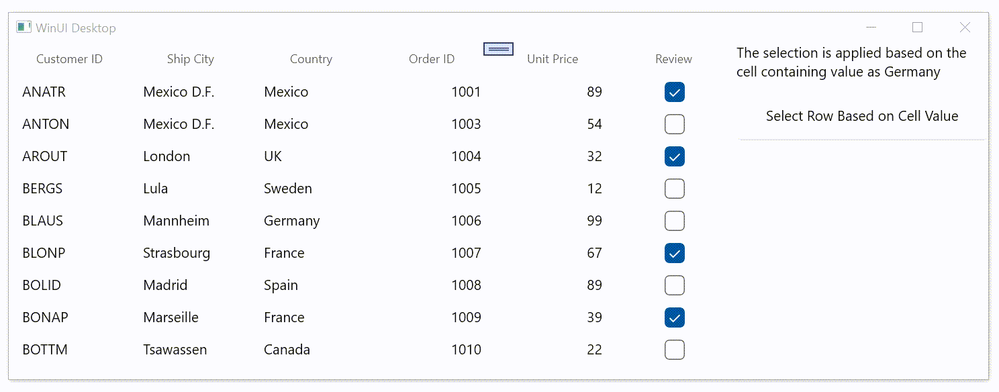

# How to select the rows based on a cell value in WinUI DataGrid SfDataGrid

You can select the rows based on cell value by adding corresponding records to [SelectedItems](https://help.syncfusion.com/cr/winui/Syncfusion.UI.Xaml.Grids.SfGridBase.html#Syncfusion_UI_Xaml_Grids_SfGridBase_SelectedItems) in [WinUI DataGrid](https://www.syncfusion.com/winui-controls/datagrid) (SfDataGrid). You can get the cell value of the particular cell using [GetPropertyAccessprovider](https://help.syncfusion.com/cr/winui/Syncfusion.UI.Xaml.Data.ICollectionViewAdv.html#Syncfusion_UI_Xaml_Data_ICollectionViewAdv_GetPropertyAccessProvider) method in **SfDataGrid.View**, as shown in the following code example.

```C#

private void btnSelectRowClicked(object sender, RoutedEventArgs e)
{
    if (dataGrid.View != null)
    {
        reflector = dataGrid.View.GetPropertyAccessProvider();

        if (reflector != null)
        {
            // Check the DataGrid has rows and columns.
            if (dataGrid.View.Records != null && dataGrid.Columns != null)
            {
                // Clear the previously selected items in SfDataGrid
                dataGrid.SelectedItems.Clear();

                // Get the total number of rows in the DataGrid.
                var totalRowIndex = dataGrid.View.Records.Count;

                // Get the total number of columns in the DataGrid.
                var totalColumnIndex = dataGrid.Columns.Count;

                // Iterate the rows.
                for (int recordIndex = 0; recordIndex < totalRowIndex; recordIndex++)
                {
                    // Iterate the columns.
                    for (int colindex = 0; colindex < totalColumnIndex; colindex++)
                    {
                        // Get the record based on recordIndex.
                        var record = this.dataGrid.View.Records[recordIndex];

                        if (record != null)
                        {
                            // Get the mappingName of the column.
                            var mappingName = dataGrid.Columns[colindex].MappingName;

                            if (mappingName != null)
                            {
                                //Get the cell value based on mappingName.
                                var currentCellValue = reflector.GetValue(record.Data, mappingName);

                                // Check the cell value is equal to "Germany".
                                if (currentCellValue != null && currentCellValue.ToString() == "Germany")
                                {
                                    // Get the record entry based on recordIndex that satisfied the condition.
                                    RecordEntry item = dataGrid.View.Records[recordIndex];

                                    if (item != null && dataGrid.SelectedItems != null)
                                    {
                                        //selected rows should be added here.
                                        dataGrid.SelectedItems.Add(item.Data);
                                    }
                                }
                            }
                        }
                    }
                }
            }
        }
    }
}

```



Take a moment to peruse the [WinUI DataGrid - Selection](https://help.syncfusion.com/winui/datagrid/selection) documentation, to learn more about selection with code examples.
